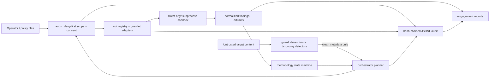

# Architecture

Sentinel is one Go binary with explicit trust boundaries. Models and external
security tools are replaceable components; authorization is not.

## Trust boundaries

1. Operator files define authorization, scope, program rules, probe suites, and
   high-risk content. They are validated but never inferred.
2. `internal/authz` is the mandatory boundary for active adapters. Deny rules,
   kill switch, automation prohibitions, engagement attestation, and bounty
   restrictions are trusted code.
3. Tool output and target content are untrusted data. The guard's deterministic
   detectors run before that content can influence the orchestrator.
4. Claude may propose a next step. Raw observation/finding prose is excluded
   from its planning prompt, and trusted code reclassifies every proposal,
   constrains it to the next methodology stage, and authorizes it again.
5. External tools receive direct `[]string` argv through a bounded,
   context-cancelled subprocess executor. Sentinel never invokes a shell and
   never escalates privilege.
6. Reports read only verified audit chains. A modified or deleted event causes
   report generation to fail.

## Packages

| Package | Responsibility |
|---|---|
| `scanner`, `analyzer` | Source discovery, chunking, Anthropic client, retry, static security analysis |
| `guard/{detect,intent,verify}` | Taxonomy detection and four-layer agent intent verification |
| `authz` | Scope, consent, kill switch, engagement, program, and revocation policy |
| `engagement` | Portable authorization records and hash-chained audit storage |
| `tools` | Common adapter lifecycle, registry, execution sandbox, results |
| `tools/{nmap,hping,tshark,...}` | Narrow wrappers and parsers for maintained external tools |
| `methodology` | Ordered, resumable security workflow and HUNT-style suggestions |
| `knowledge` | Typed SecLists catalog, parameter map, factual cloud metadata dictionary |
| `redteam` | Shared Arcanum-derived taxonomy and approved HTTP suite runner |
| `orchestrator` | Claude/offline planning plus deterministic proposal enforcement |
| `ctf`, `bounty` | Strict policy import and CTF regression scoring |
| `report` | Terminal, Markdown, JSON, and SARIF renderers |

## Data flow and persistence

- Scan configuration follows flags → environment → `.sentinel.yaml` → defaults.
- Operational paths come from `SENTINEL_ENGAGEMENT_DIR`,
  `SENTINEL_STATE_DIR`, and `SENTINEL_AUDIT_LOG`.
- Engagement/state/audit data defaults under ignored `.sentinel-data/` with
  owner-only permissions.
- Methodology state and engagement records are atomically replaced JSON.
- Audit events are append-only JSONL with a SHA-256 previous-record chain.
- Large knowledge sources are sparse-cloned on demand into ignored
  `knowledge-data/`.

## Runtime

Passive features work on normal macOS, Linux, and Windows builds. Active
external adapters require the reproducible Kali Dev Container. Runtime checks
print the exact `make dev` recovery instruction; granular file capabilities
cover raw packets and capture rather than running the entire binary as root.
